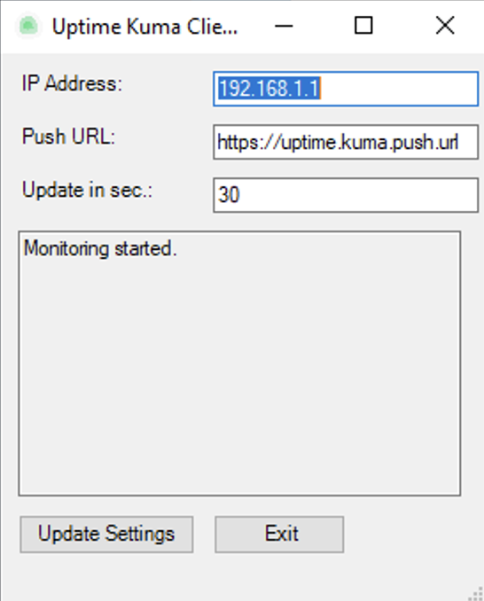

<h1 align="center">Uptime Kuma Client for Windows</h1>

  

The development of this one was driven by the need for a simple, yet effective Uptime Kuma Client for Windows. Also to make it accessable for all user levels without fiddeling with scripts, and yet having the option to use the push Monitor-Type behind a firewall for example.

By using push monitors you can monitor any servers that aren’t reachable from the internet but are able to reach the internet. Servers behind a NAT, or having outgoing internet access only using a proxy for instance.
This client can be seen as a bridge to devices where you can't run, push notification scripts on themselves for example. But for sure can also be used if you don't want to hassle with a cron type of functionality or powershell script on windows.

# Key Features:
<b>User-Friendly Interface:</b> Simple and intuitive, suitable for all user levels.

<b>Customizable Settings:</b> Easily set the IP address, URL, and update intervals as per user preference. Default is 30 seconds.

<b>Persistent Settings:</b> Remembers and reloads the last used settings upon restart.

<b>Daily Uptime Tracking:</b> Shows the first uptime of the day.

# How to install:

- Download [here](https://cloud.rdnsx.de/index.php/s/6wYoWJbFxEGqK8k/download).

- Extract to desired path.

- Start.